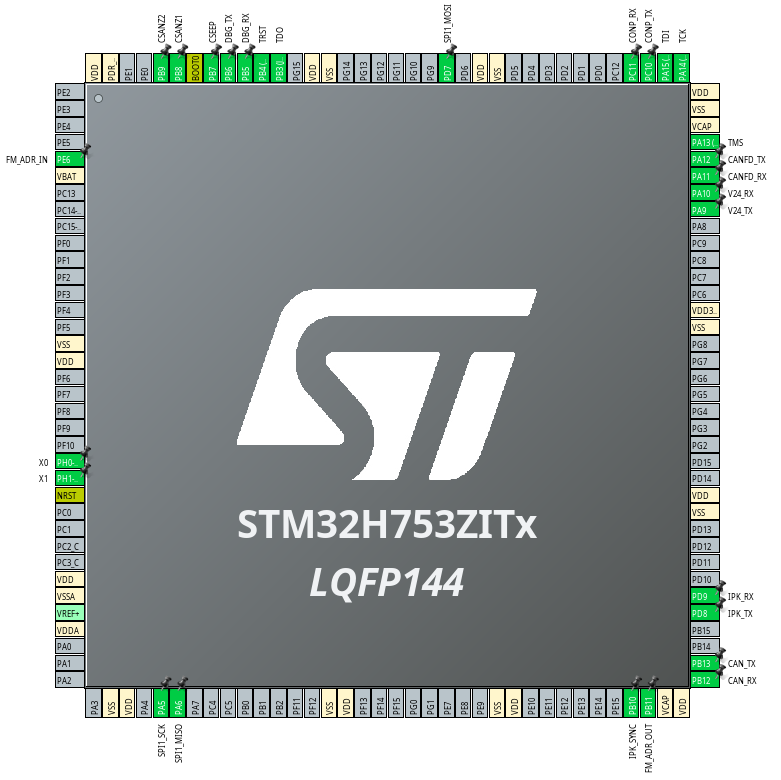

# sl-vario.zmve.firmware
This repository contains all firmware relevant things for the ZMVe. TEST

## Requirements
 * STM32CubeCLT 1.16.0 (https://www.st.com/en/development-tools/stm32cubeclt.html)
 * CMake Version 3.22 (https://cmake.org/)

## Pinouts
### Master

### Slave 

